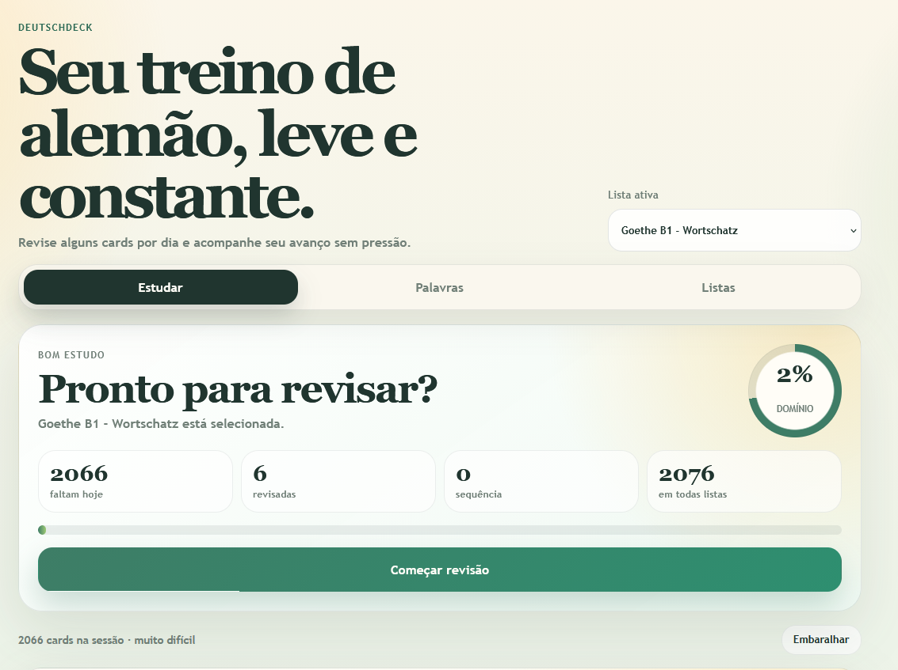

# DeutschDeck

Aplicacao web para estudo de vocabulario em alemao com foco em revisao diaria, acompanhamento de progresso e criacao de listas personalizadas.

Projeto publicado: [german-flashcards-delta.vercel.app](https://german-flashcards-delta.vercel.app/)

## Visao geral

O DeutschDeck foi desenvolvido para tornar o estudo de alemao mais leve, visual e constante. A experiencia foi pensada para quem quer revisar palavras todos os dias sem depender de uma interface complicada, com acompanhamento claro do que precisa ser estudado e do que ja foi consolidado.

Como projeto de portfolio, ele destaca minha capacidade de desenvolver uma aplicacao completa do frontend ao deploy, com atencao para usabilidade, persistencia de dados no navegador e experiencia semelhante a app nativo.

## Destaque: PWA

Um dos principais diferenciais do projeto e que ele foi construido como **PWA (Progressive Web App)**.

Isso significa que a aplicacao:

- pode ser instalada no celular ou no desktop
- funciona em modo standalone, com aparencia de app
- possui estrutura preparada para cache e carregamento rapido
- oferece uma experiencia mobile-first mais proxima de um produto real

## Preview



## Funcionalidades

- revisao de flashcards com repeticao espacada
- listas pre-carregadas e criacao de listas personalizadas
- cadastro, edicao e exclusao de palavras
- acompanhamento de progresso diario
- indicadores de dominio, sequencia e dificuldade
- armazenamento local dos dados do usuario no navegador

## Tecnologias utilizadas

- React
- TypeScript
- Vite
- `vite-plugin-pwa`
- Vercel

## O que este projeto demonstra

- desenvolvimento de interface responsiva com foco em experiencia do usuario
- organizacao de estado e regras de negocio no frontend
- uso de recursos modernos da plataforma web para criar um PWA instalavel
- publicacao de uma aplicacao real em producao

## Como executar localmente

```bash
npm install
npm run dev
```

## Objetivo no portfolio

Este projeto representa meu interesse em construir produtos web uteis, bem apresentados e com preocupacao real com a experiencia final. Para uma candidatura de estagio, ele demonstra iniciativa, autonomia para publicar uma aplicacao completa e cuidado com detalhes de produto, nao apenas com a implementacao tecnica.
